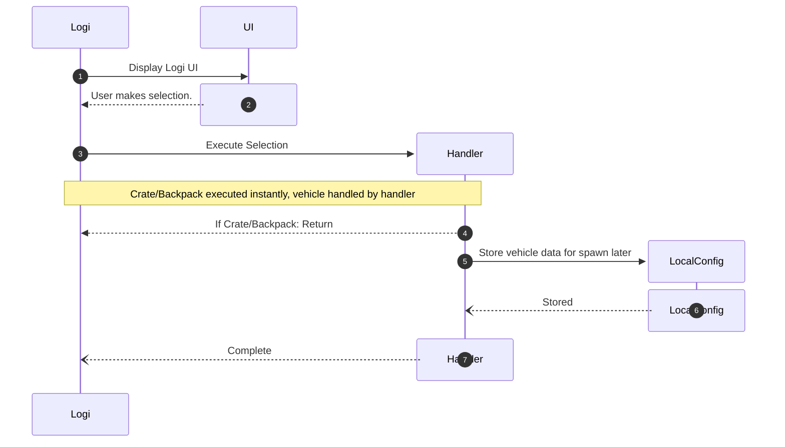
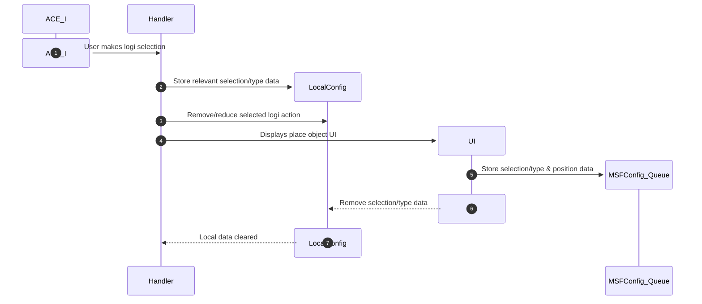
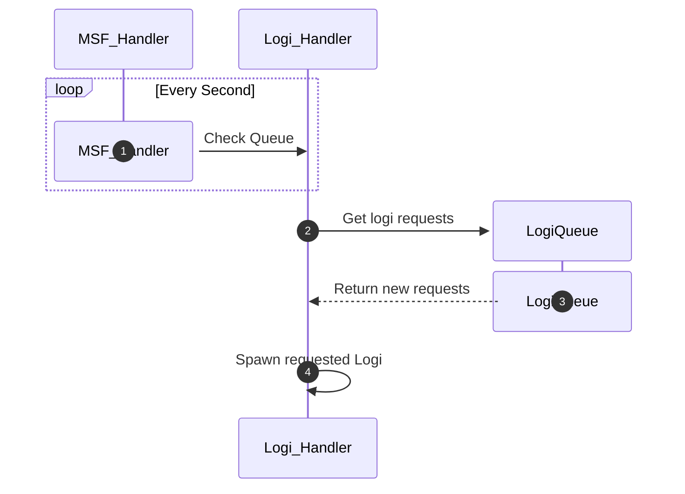

# Logistics System Sequence Diagrams

## Logi Initial Interaction

```mermaid
sequenceDiagram
    autonumber
    Logi->>UI: Display Logi UI
    destroy UI
    UI-->>Logi: User makes selection.
    create participant Handler
    Logi->>Handler: Execute Selection
    Note over Logi,Handler: Crate/Backpack executed instantly, vehicle handled by handler
    Handler-->>Logi: If Crate/Backpack: Return
    create participant LocalConfig
    Handler->>LocalConfig: Store vehicle data for spawn later
    destroy LocalConfig
    LocalConfig--)Handler: Stored
    destroy Handler
    Handler--)Logi: Complete
```

## Logi Stored ACE Interaction

```mermaid
sequenceDiagram
    autonumber
    destroy ACE_I
    ACE_I->>Handler: User makes logi selection
    create participant LocalConfig
    Handler->>LocalConfig: Store relevant selection/type data
    Handler->>LocalConfig: Remove/reduce selected logi action
    create participant UI
    Handler->>UI: Displays place object UI
    create participant MSFConfig as MSFConfig_Queue
    UI->>MSFConfig: Store selection/type & position data
    destroy UI
    UI-->>LocalConfig: Remove selection/type data
    destroy LocalConfig
    LocalConfig-->>Handler: Local data cleared

```

## Logi Handler

```mermaid
sequenceDiagram
    autonumber
    loop Every Second
        destroy MSF_Handler
        MSF_Handler->>Logi_Handler: Check Queue
    end
    create participant LogiQueue
    Logi_Handler->>LogiQueue: Get logi requests
    destroy LogiQueue
    LogiQueue-->>Logi_Handler: Return new requests
    Logi_Handler->>Logi_Handler: Spawn requested Logi
```