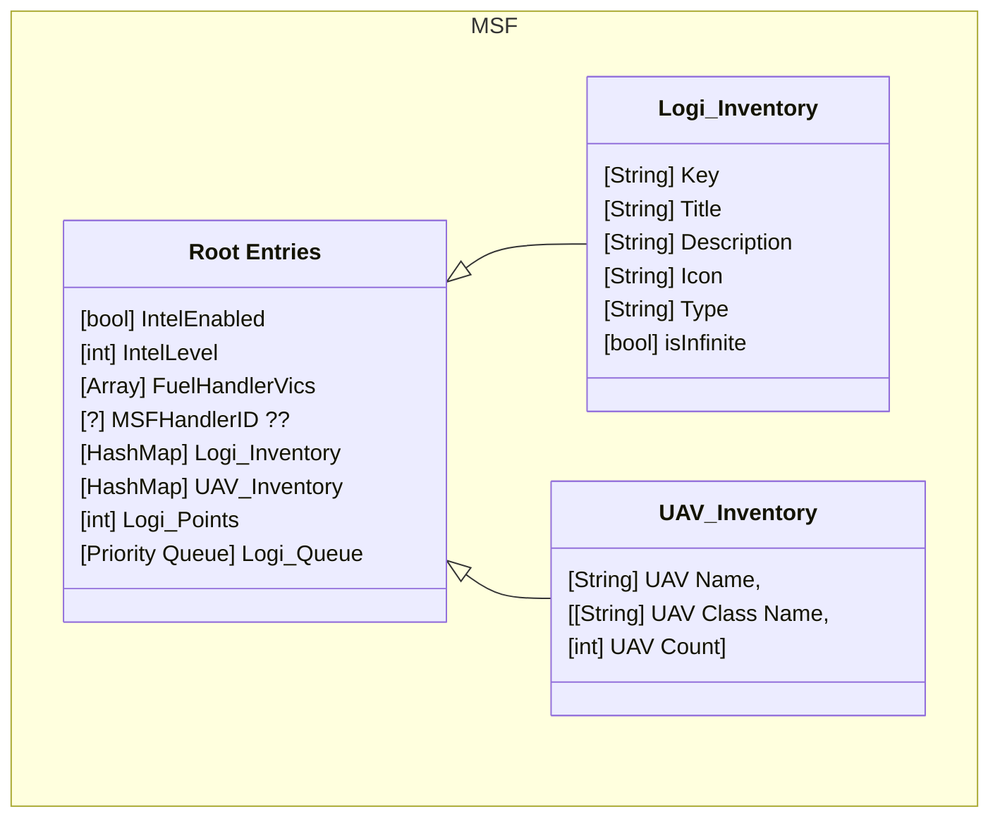
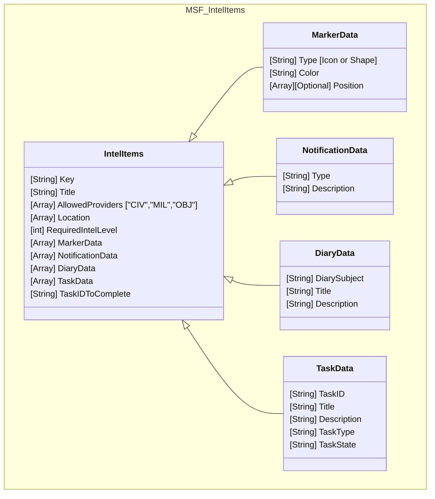
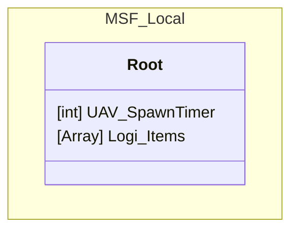

[SETUP: Viewing this file.](#setup)
# MSF Config Diagrams

### Setup
Install this extension.  
[Markdown Preview Mermaid Extention](https://marketplace.visualstudio.com/items?itemName=bierner.markdown-mermaid)  
[Docs](https://mermaid.js.org/syntax/classDiagram.html#defining-relationship)